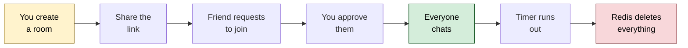
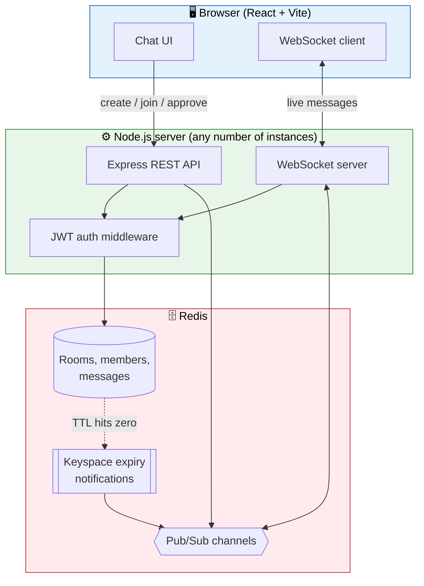
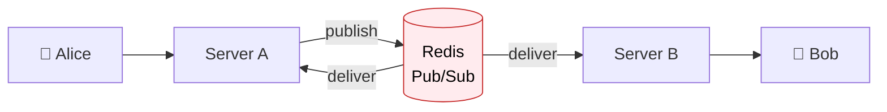
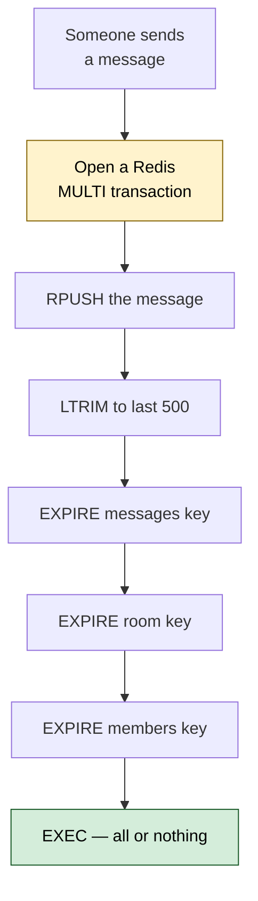
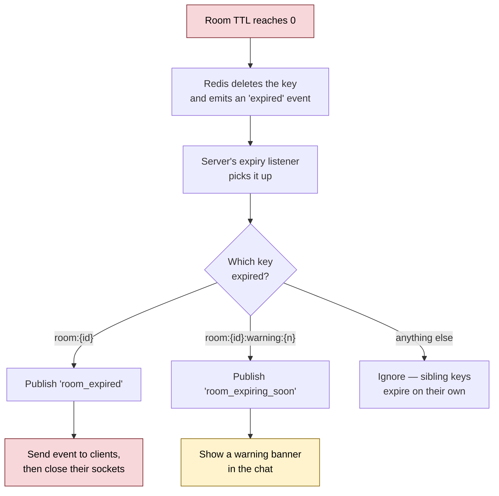
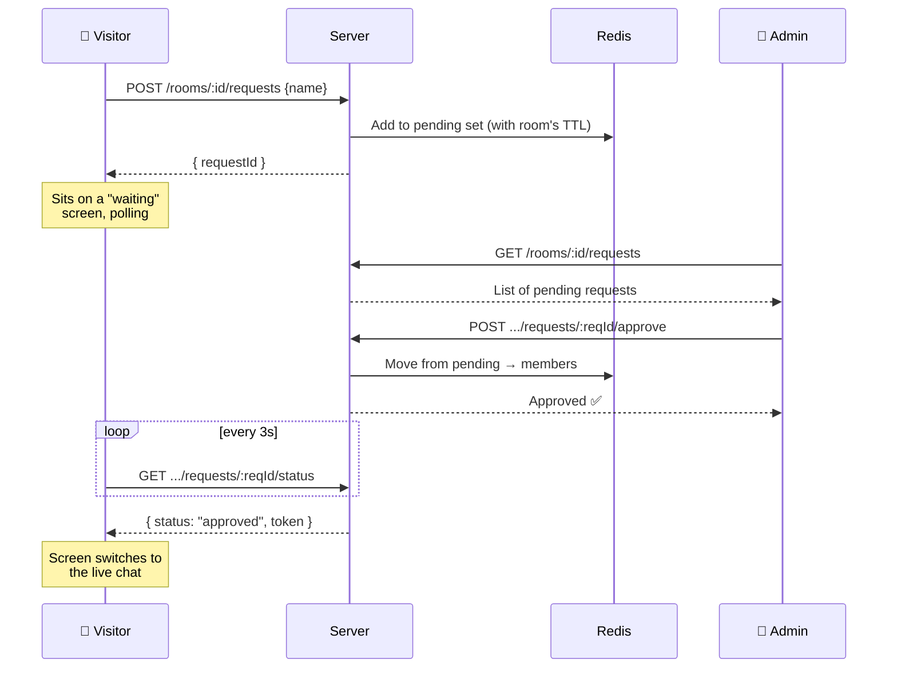
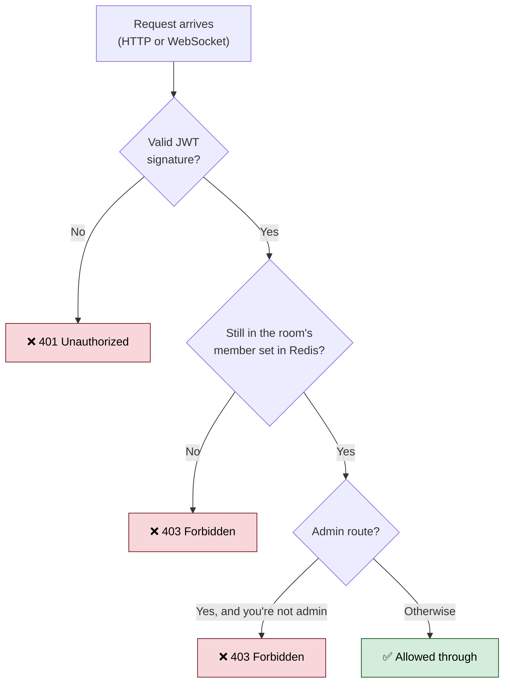

# EphemChat

A chat app where rooms delete themselves.

You create a room, pick how long it should live, and share the link. People request to join, you approve them, everyone chats. When the timer runs out, Redis deletes the room, the messages, and the member list — and everyone still connected gets disconnected automatically. Nothing is left behind, because nothing was ever written to a database.

   

---

## Table of contents

- [What it does](#what-it-does)
- [How it works](#how-it-works)
- [Architecture](#architecture)
- [How data expires](#how-data-expires)
- [How joining a room works](#how-joining-a-room-works)
- [How auth works](#how-auth-works)
- [Running it locally](#running-it-locally)
- [Project structure](#project-structure)
- [API reference](#api-reference)
- [WebSocket events](#websocket-events)
- [Redis keys](#redis-keys)
- [Design decisions](#design-decisions)

---

## What it does

| Feature | Description |
| --- | --- |
| **Self-expiring rooms** | Pick a lifetime from 1 minute to 2 hours. Everything is gone when it ends. |
| **Admin approval** | Anyone with the link can *ask* to join. Only the admin can let them in. |
| **Real-time chat** | Messages arrive over WebSockets, not polling. |
| **Expiry warning** | Optional heads-up before the room closes ("closes in 30s"). |
| **Kick members** | The admin can remove someone; their connection closes immediately. |
| **Multi-instance ready** | Run several backend servers behind a load balancer — messages still reach everyone. |
| **No database** | Redis only. When the TTL ends, the data is genuinely deleted. |

---

## How it works

The short version, from the moment you open the app:



---

## Architecture

Three layers. The browser talks to the server, the server talks to Redis, and Redis talks back to the server when something expires.



**Why the server doesn't keep chat state in memory:** each server instance only tracks the sockets *it personally holds*. Everything else goes through Redis Pub/Sub. That means a message sent to server A reaches a user connected to server B, without the two servers knowing about each other.



---

## How data expires

This is the core of the whole project, so it's worth understanding properly.

Every key belonging to a room carries the **same TTL**, and every write refreshes it. There's no background cleanup job and no cron — Redis itself is the timer.



Because it's a single transaction, a crash halfway through can't leave one key refreshed and another stale.

When the room's own key finally expires, Redis fires a **keyspace notification**, and the server reacts:



> **The warning trick:** the "closes in 30 seconds" notice isn't a timer in the app. It's a second Redis key (`room:{id}:warning:30`) set to expire 30 seconds *before* the room does. When Redis kills it, that's the signal. The lead time lives in the key's *name* because the key's value is already gone by the time the event arrives.

---

## How joining a room works



The visitor's browser can't be pushed to directly — it has no token yet, so it can't hold a WebSocket. It polls a status endpoint using its `requestId` as a claim ticket, and the moment the admin approves, that endpoint hands back a real token.

---

## How auth works

Two checks, every single time:



**The token proves who you say you are. Redis proves you're still allowed in.** You need both — otherwise a kicked member could keep using a token that hasn't expired yet.

Crucially, the **WebSocket upgrade runs this same check before the connection is accepted**, not after. No token, no connection.

---

## Running it locally

### You'll need

- Node.js 18 or newer
- Docker (easiest way to run Redis), or a local Redis 7 install

### 1. Start Redis

```bash
docker run -d --name ttl-redis -p 6379:6379 redis:7
```

Check it's alive:

```bash
docker exec -it ttl-redis redis-cli ping
# → PONG
```

### 2. Start the backend

```bash
cd backend
npm install
```

Create `backend/.env`:

```env
REDIS_URL=redis://localhost:6379
JWT_SECRET=paste-a-long-random-string-here
PORT=8080
```

Generate a real secret rather than typing one:

```bash
node -e "console.log(require('crypto').randomBytes(32).toString('hex'))"
```

Then:

```bash
npm run dev
# → Server listening on port 8080
```

### 3. Start the frontend

```bash
cd frontend
npm install
```

Create `frontend/.env`:

```env
VITE_BACKEND_URL=http://localhost:8080
VITE_WS_URL=ws://localhost:8080
```

Then:

```bash
npm run dev
# → http://localhost:5173
```

Open that URL and create a room.

### Trying the multi-instance setup

Want to see the Pub/Sub layer actually doing its job? Start a second backend on a different port:

```bash
# PowerShell
$env:PORT=8081; npm run dev

# bash
PORT=8081 npm run dev
```

Connect one person through `localhost:8080` and another through `localhost:8081`. They'll see each other's messages, because both servers are subscribed to the same Redis channel.

---

## Project structure

```
EphemChat/
├── backend/
│   └── src/
│       ├── config/          # Loads and validates .env (fails fast on bad config)
│       ├── redis/
│       │   ├── client.ts        # Three connections: commands, publish, subscribe
│       │   ├── keys.ts          # Every Redis key name is built here, nowhere else
│       │   └── expiryListener.ts # Reacts to Redis keyspace expiry events
│       ├── auth/
│       │   ├── token.ts         # Sign and verify JWTs
│       │   └── middleware.ts    # requireAuth() — token + live membership check
│       ├── rooms/
│       │   ├── rooms.service.ts # All Redis logic lives here
│       │   └── rooms.routes.ts  # Express routes
│       ├── ws/
│       │   ├── wsServer.ts      # Upgrade handling + per-instance socket tracking
│       │   └── pubsub.ts        # Cross-instance broadcast
│       └── server.ts        # Wires Express + WebSocket + expiry listener together
└── frontend/
    └── src/
        ├── pages/           # Home (create room), ChatRoom (everything else)
        ├── components/      # ApprovalPanel, MemberList
        ├── hooks/
        │   └── useChatSocket.ts # Owns history fetch + socket lifecycle
        ├── lib/             # API client, JWT decoding
        └── types.ts         # Shared types, including the WS event union
```

> **Why `keys.ts` matters:** every Redis key string is generated by one file. It sounds pedantic until you've debugged a system where three files each spell the same key slightly differently.

---

## API reference

| Method | Endpoint | Auth | What it does |
| --- | --- | --- | --- |
| `POST` | `/rooms` | — | Create a room, get back `roomId` + admin token |
| `GET` | `/rooms/:roomId` | — | Room name, or 404 if expired |
| `POST` | `/rooms/:roomId/requests` | — | Ask to join, get a `requestId` |
| `GET` | `/rooms/:roomId/requests/:reqId/status` | — | Poll for approval; returns a token once approved |
| `GET` | `/rooms/:roomId/requests` | Admin | List pending join requests |
| `POST` | `/rooms/:roomId/requests/:reqId/approve` | Admin | Approve someone, issue their token |
| `GET` | `/rooms/:roomId/members` | Member | List current members |
| `DELETE` | `/rooms/:roomId/members/:userId` | Admin | Kick someone |
| `GET` | `/rooms/:roomId/messages` | Member | Message history |
| `GET` | `/ws?token=...` | Member | Upgrade to a WebSocket |

### Creating a room

```bash
curl -X POST http://localhost:8080/rooms \
  -H "Content-Type: application/json" \
  -d '{
    "roomName": "Standup",
    "adminName": "Harshul",
    "ttlSeconds": 1800,
    "warningLeadSeconds": 60
  }'
```

```json
{
  "roomId": "4820c53a-1794-47eb-9d56-8163de851b4d",
  "token": "eyJhbGciOiJIUzI1NiIsInR5cCI6IkpXVCJ9..."
}
```

`ttlSeconds` accepts 60–7200. `warningLeadSeconds` is optional; leave it out and no warning fires.

---

## WebSocket events

Connect to `ws://localhost:8080/ws?token=<your-token>`.

**Send:**

```json
{ "type": "message", "text": "hello" }
```

**Receive:**

| Event | Payload | Meaning |
| --- | --- | --- |
| `message` | `userId`, `name`, `text`, `ts` | Someone sent a message |
| `user_joined` | `userId`, `name` | Someone connected |
| `user_left` | `userId` | Someone disconnected |
| `member_removed` | `userId` | Someone was kicked (that user's socket also closes) |
| `room_expiring_soon` | `secondsLeft` | Warning before the room dies |
| `room_expired` | — | Room is gone; the socket closes right after |

**Close codes:**

| Code | Meaning |
| --- | --- |
| `4401` | Not authorized |
| `4403` | Removed by the admin |
| `4410` | Room expired |

---

## Redis keys

| Key | Type | Holds |
| --- | --- | --- |
| `room:{id}` | Hash | `roomName`, `adminId`, `createdAt` |
| `room:{id}:members` | Set | Approved member IDs |
| `room:{id}:member:{userId}` | Hash | That member's display name |
| `room:{id}:requests` | Set | Pending request IDs |
| `room:{id}:requests:{reqId}` | Hash | Requester's name |
| `room:{id}:messages` | List | Last 500 messages as JSON |
| `room:{id}:warning:{n}` | String | Expiry-warning trigger (`n` = seconds of lead time) |

All of them share the room's TTL, refreshed on every write.

---

## Design decisions

**Redis holds the truth, not the server.** An earlier approach kept room membership and admin identity in an in-memory `Map`. That works fine until you restart the process or run a second one. Everything durable now lives in Redis, and each server instance only tracks the sockets it's personally holding.

**One message format, not two.** Messages are a Redis List (`RPUSH` / `LRANGE`), capped with `LTRIM`. Mixing a Stream and a List on the same key is a quick way to get a `WRONGTYPE` error in production.

**TTL is refreshed on every write, never set once.** The failure mode this avoids is subtle and nasty: the room hash expires on schedule but the message list quietly lives forever, because someone called `EXPIRE` once at creation and never again.

**Auth happens before the WebSocket upgrade.** It's tempting to accept the connection and check credentials on the first message. Don't — that's an open socket to a private room for however long that takes.

**The frontend is a plain client.** No server-side rendering, no API routes in the frontend framework. There's a real backend doing that work, and blurring the line makes both harder to reason about. Vite + React keeps the split honest.

---

## License

MIT